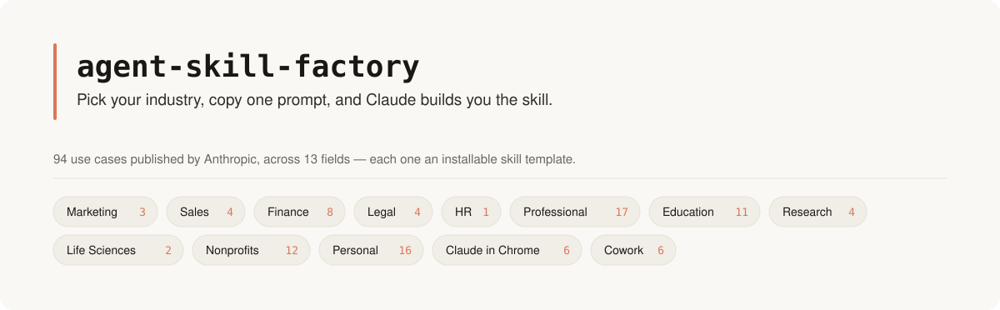
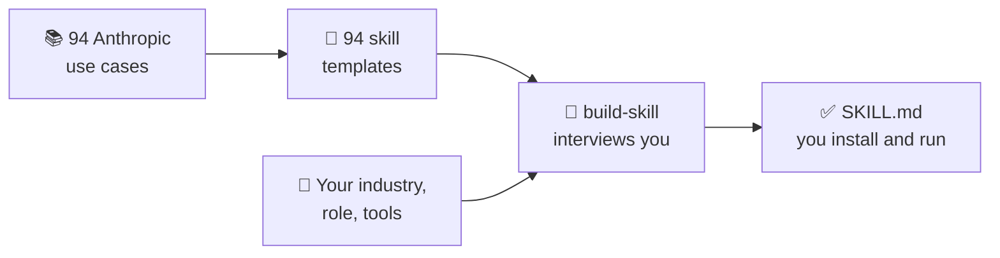

<!-- Structure follows othneildrew/Best-README-Template: centered header, collapsible
     TOC, back-to-top links, reference-style badge definitions at the bottom. -->
<a id="readme-top"></a>

<div align="center">

<picture>
  <source media="(prefers-color-scheme: dark)" srcset=".github/assets/banner-dark.svg">
  <source media="(prefers-color-scheme: light)" srcset=".github/assets/banner-light.svg">
  
</picture>

<br><br>

[![Use cases][usecases-shield]][usecases-url]
[![Fields][fields-shield]][fields-url]
[![Templates][templates-shield]][templates-url]
[![License][license-shield]][license-url]

<br>

[![Quick start][quickstart-shield]](#quick-start)
[![Pick your field][fieldpicker-shield]](#pick-your-field-94-prompts)
[![Build your own][buildyourown-shield]](#build-your-own)
[![Docs][docs-shield]](#whats-here)

<br>

<details>
<summary><strong>Table of Contents</strong></summary>
<ol>
  <li><a href="#quick-start">Quick start</a></li>
  <li><a href="#build-your-own">Build your own — the universal prompt</a></li>
  <li>
    <a href="#pick-your-field-94-prompts">Pick your field (94 prompts)</a>
    <ul>
      <li><a href="#field-marketing">Marketing</a> · <a href="#field-sales">Sales</a> · <a href="#field-finance">Finance</a> · <a href="#field-legal">Legal</a> · <a href="#field-hr">HR</a></li>
      <li><a href="#field-professional">Professional</a> · <a href="#field-education">Education</a> · <a href="#field-research">Research</a> · <a href="#field-life-sciences">Life Sciences</a></li>
      <li><a href="#field-nonprofits">Nonprofits</a> · <a href="#field-personal">Personal</a></li>
      <li><a href="#field-claude-in-chrome">Claude in Chrome</a> · <a href="#field-cowork">Cowork</a> <em>(surfaces)</em></li>
    </ul>
  </li>
  <li><a href="#prefer-to-start-from-the-template-file">Prefer to start from the template file?</a></li>
  <li>
    <a href="#install-paths">Install paths</a>
    <ul>
      <li><a href="#i-have-nodejs--a-terminal">Node.js / terminal</a></li>
      <li><a href="#no-terminal-copy-paste-install">No terminal (copy-paste)</a></li>
      <li><a href="#by-hand">By hand</a></li>
    </ul>
  </li>
  <li><a href="#whats-here">What's here</a></li>
  <li><a href="#design-decisions-worth-knowing">Design decisions worth knowing</a></li>
  <li><a href="#quality-review">Quality review</a></li>
  <li><a href="#end-to-end-examples">End-to-end examples</a></li>
  <li><a href="#contributing">Contributing</a></li>
</ol>
</details>

</div>

<br>

This repo takes all **94 use cases Anthropic publishes** at
[claude.com/resources/use-cases](https://claude.com/resources/use-cases) and turns each
one into a skill you can build for *your* industry: a catalog entry, a ready skill
template, and a copy-paste prompt that says "build this, but for my field." Plus
**`build-skill`** — the meta-skill that interviews you and writes the finished SKILL.md.



Not an official Anthropic project. See [ATTRIBUTION.md](ATTRIBUTION.md).

---

## Quick start

<table>
<tr>
<td width="33%" valign="top">

**1 · Install**

```bash
npx skills add iankiku/agent-skill-factory \
  --skill build-skill
```

No terminal? [Copy-paste path ↓](#no-terminal-copy-paste-install)

</td>
<td width="33%" valign="top">

**2 · Pick your field**

Open your field in
[Pick your field ↓](#pick-your-field-94-prompts)
and hit the copy button on
its prompt.

Nothing fits? Use the
[universal prompt ↓](#build-your-own).

</td>
<td width="33%" valign="top">

**3 · Paste into Claude**

Swap the `[BRACKETED]`
placeholders for your
industry, role, and tools.

Claude interviews you on the
rest and hands back an
installable skill.

</td>
</tr>
</table>

That's the whole loop. Everything below is detail.

<p align="right">(<a href="#readme-top">back to top ↑</a>)</p>

---

<a id="build-your-own"></a>

## Build your own — the universal prompt

Nothing in the catalog matches? Use this one — it works for any workflow, in any
industry, with no template.

```text
Build me a Claude skill for [MY INDUSTRY].

The workflow I want to make repeatable: [DESCRIBE THE WORKFLOW IN ONE OR TWO SENTENCES]

My context — industry: [MY INDUSTRY] · role: [MY ROLE] · tools I use: [MY TOOLS]
Inputs a run consumes: [FILES / FOLDERS / CONNECTORS / MESSAGES]
What exists afterward that didn't before: [THE ARTIFACT]
What separates a good run from a technically-complete one: [THE BAR]

Use the build-skill workflow: pin the outcome, pick the closest of the 94 templates
(or a blank one if nothing fits), specify tools, auth, permissions, validation,
failure modes, and delegation — then dry-run it on paper before I trust it.
```

If you answer "I don't know" to something, `build-skill` re-asks with concrete
options, and after three tries it picks a labeled default and keeps going rather than
stalling.

<p align="right">(<a href="#readme-top">back to top ↑</a>)</p>

---

## Pick your field (94 prompts)

Pick a pill to jump to your field, then expand it. Each entry gives you the source use
case, a catalog doc (verbatim prompt + attribution), a scaffolded skill template, and a
prompt that builds it for your industry. Grey pills are delivery surfaces, not industries.

<!-- BEGIN GENERATED: field prompts (scripts/generate.py) -->

<div align="center">

[](#field-marketing) [](#field-sales) [](#field-finance) [](#field-legal) [](#field-hr) [](#field-professional) [](#field-education) [](#field-research) [](#field-life-sciences) [](#field-nonprofits) [](#field-personal) [](#field-claude-in-chrome) [](#field-cowork)

</div>

*94 use cases across 13 fields. Expand a field, hit the copy button on the prompt, swap the bracketed placeholders, paste into Claude.*

<a id="field-marketing"></a>
<details>
<summary><strong>Marketing</strong> — Campaign analysis, personas, and cross-platform content. <code>3</code></summary>

<br>

#### Adapt content across platforms

Transform one piece of content into multiple formats adapted for different platforms and audiences.  
[Source](https://claude.com/resources/use-cases/adapt-content-across-platforms) · [Catalog doc](catalog/marketing/adapt-content-across-platforms.md) · [Template](templates/marketing/adapt-content-across-platforms/SKILL.md)

```text
Build me a Claude skill for [MY INDUSTRY].

Model it on the Anthropic use case "Adapt content across platforms":
https://github.com/iankiku/agent-skill-factory/blob/main/templates/marketing/adapt-content-across-platforms/SKILL.md

Industry:   [MY INDUSTRY]
Role:       [MY ROLE]
Tools:      [MY TOOLS]
Runs when:  [TRIGGER]

Interview me on anything missing, resolve every TODO, and hand me
a finished SKILL.md I can install and run unattended.
```

#### Analyze campaign performance

Analyze campaign performance data to identify your best and worst performing channels, then get specific budget reallocation recommendations for next…  
[Source](https://claude.com/resources/use-cases/analyze-campaign-performance) · [Catalog doc](catalog/marketing/analyze-campaign-performance.md) · [Template](templates/marketing/analyze-campaign-performance/SKILL.md)

```text
Build me a Claude skill for [MY INDUSTRY].

Model it on the Anthropic use case "Analyze campaign performance":
https://github.com/iankiku/agent-skill-factory/blob/main/templates/marketing/analyze-campaign-performance/SKILL.md

Industry:   [MY INDUSTRY]
Role:       [MY ROLE]
Tools:      [MY TOOLS]
Runs when:  [TRIGGER]

Interview me on anything missing, resolve every TODO, and hand me
a finished SKILL.md I can install and run unattended.
```

#### Build customer personas

Create personas with demographics, goals, and pain points synthesized from your research data.  
[Source](https://claude.com/resources/use-cases/build-customer-personas) · [Catalog doc](catalog/marketing/build-customer-personas.md) · [Template](templates/marketing/build-customer-personas/SKILL.md)

```text
Build me a Claude skill for [MY INDUSTRY].

Model it on the Anthropic use case "Build customer personas":
https://github.com/iankiku/agent-skill-factory/blob/main/templates/marketing/build-customer-personas/SKILL.md

Industry:   [MY INDUSTRY]
Role:       [MY ROLE]
Tools:      [MY TOOLS]
Runs when:  [TRIGGER]

Interview me on anything missing, resolve every TODO, and hand me
a finished SKILL.md I can install and run unattended.
```

</details>

<a id="field-sales"></a>
<details>
<summary><strong>Sales</strong> — Deal prep, proposals, battle cards, and pipeline reporting. <code>4</code></summary>

<br>

#### Build a battle card library

Turn sales losses and competitive data into ready-to-use battlecards with winning talk tracks, objection handlers, and differentiation strategies…  
[Source](https://claude.com/resources/use-cases/build-a-battle-card-library) · [Catalog doc](catalog/sales/build-a-battle-card-library.md) · [Template](templates/sales/build-a-battle-card-library/SKILL.md)

```text
Build me a Claude skill for [MY INDUSTRY].

Model it on the Anthropic use case "Build a battle card library":
https://github.com/iankiku/agent-skill-factory/blob/main/templates/sales/build-a-battle-card-library/SKILL.md

Industry:   [MY INDUSTRY]
Role:       [MY ROLE]
Tools:      [MY TOOLS]
Runs when:  [TRIGGER]

Interview me on anything missing, resolve every TODO, and hand me
a finished SKILL.md I can install and run unattended.
```

#### Create a sales proposal presentation

Create a polished client proposal deck with professional layouts data visualizations and cohesive design—then refine through feedback until it…  
[Source](https://claude.com/resources/use-cases/create-a-sales-proposal-presentation) · [Catalog doc](catalog/sales/create-a-sales-proposal-presentation.md) · [Template](templates/sales/create-a-sales-proposal-presentation/SKILL.md)

```text
Build me a Claude skill for [MY INDUSTRY].

Model it on the Anthropic use case "Create a sales proposal presentation":
https://github.com/iankiku/agent-skill-factory/blob/main/templates/sales/create-a-sales-proposal-presentation/SKILL.md

Industry:   [MY INDUSTRY]
Role:       [MY ROLE]
Tools:      [MY TOOLS]
Runs when:  [TRIGGER]

Interview me on anything missing, resolve every TODO, and hand me
a finished SKILL.md I can install and run unattended.
```

#### Create sales reports

Pull metrics from your CRM, analyze trends, and generate polished reports with data visualizations and strategic insights—all without manual data…  
[Source](https://claude.com/resources/use-cases/create-sales-reports) · [Catalog doc](catalog/sales/create-sales-reports.md) · [Template](templates/sales/create-sales-reports/SKILL.md)

```text
Build me a Claude skill for [MY INDUSTRY].

Model it on the Anthropic use case "Create sales reports":
https://github.com/iankiku/agent-skill-factory/blob/main/templates/sales/create-sales-reports/SKILL.md

Industry:   [MY INDUSTRY]
Role:       [MY ROLE]
Tools:      [MY TOOLS]
Runs when:  [TRIGGER]

Interview me on anything missing, resolve every TODO, and hand me
a finished SKILL.md I can install and run unattended.
```

#### Prepare for sales deals

Pull relevant CRM data, like details on comparable opportunities, to prepare for upcoming sales conversations.  
[Source](https://claude.com/resources/use-cases/prepare-for-sales-deals) · [Catalog doc](catalog/sales/prepare-for-sales-deals.md) · [Template](templates/sales/prepare-for-sales-deals/SKILL.md)

```text
Build me a Claude skill for [MY INDUSTRY].

Model it on the Anthropic use case "Prepare for sales deals":
https://github.com/iankiku/agent-skill-factory/blob/main/templates/sales/prepare-for-sales-deals/SKILL.md

Industry:   [MY INDUSTRY]
Role:       [MY ROLE]
Tools:      [MY TOOLS]
Runs when:  [TRIGGER]

Interview me on anything missing, resolve every TODO, and hand me
a finished SKILL.md I can install and run unattended.
```

</details>

<a id="field-finance"></a>
<details>
<summary><strong>Finance</strong> — Models, memos, reconciliation, and spreadsheet forensics. <code>8</code></summary>

<br>

#### Build financial models

Create investment analyses with complete financial models, scenario planning, and risk evaluation.  
[Source](https://claude.com/resources/use-cases/build-financial-models) · [Catalog doc](catalog/finance/build-financial-models.md) · [Template](templates/finance/build-financial-models/SKILL.md)

```text
Build me a Claude skill for [MY INDUSTRY].

Model it on the Anthropic use case "Build financial models":
https://github.com/iankiku/agent-skill-factory/blob/main/templates/finance/build-financial-models/SKILL.md

Industry:   [MY INDUSTRY]
Role:       [MY ROLE]
Tools:      [MY TOOLS]
Runs when:  [TRIGGER]

Interview me on anything missing, resolve every TODO, and hand me
a finished SKILL.md I can install and run unattended.
```

#### Draft a credit memo from spreads and statements with Claude for Excel

Cowork pulls the borrower's filings and spreads through the S&P Capital IQ connector and reads the underwriting workbook from your deal folder. You…  
[Source](https://claude.com/resources/use-cases/draft-a-credit-memo-from-spreads-and-statements-with-claude-for-excel) · [Catalog doc](catalog/finance/draft-a-credit-memo-from-spreads-and-statements-with-claude-for-excel.md) · [Template](templates/finance/draft-a-credit-memo-from-spreads-and-statements-with-claude-for-excel/SKILL.md)

```text
Build me a Claude skill for [MY INDUSTRY].

Model it on the Anthropic use case "Draft a credit memo from spreads and statements with Claude for Excel":
https://github.com/iankiku/agent-skill-factory/blob/main/templates/finance/draft-a-credit-memo-from-spreads-and-statements-with-claude-for-excel/SKILL.md

Industry:   [MY INDUSTRY]
Role:       [MY ROLE]
Tools:      [MY TOOLS]
Runs when:  [TRIGGER]

Interview me on anything missing, resolve every TODO, and hand me
a finished SKILL.md I can install and run unattended.
```

#### Draft investment memos

Generate investment memos from platform data, formatted to match your firm's structure and requirements.  
[Source](https://claude.com/resources/use-cases/draft-investment-memos) · [Catalog doc](catalog/finance/draft-investment-memos.md) · [Template](templates/finance/draft-investment-memos/SKILL.md)

```text
Build me a Claude skill for [MY INDUSTRY].

Model it on the Anthropic use case "Draft investment memos":
https://github.com/iankiku/agent-skill-factory/blob/main/templates/finance/draft-investment-memos/SKILL.md

Industry:   [MY INDUSTRY]
Role:       [MY ROLE]
Tools:      [MY TOOLS]
Runs when:  [TRIGGER]

Interview me on anything missing, resolve every TODO, and hand me
a finished SKILL.md I can install and run unattended.
```

#### Organize your business finances

Create spreadsheets that bring clarity to your finances. Spot trends, filter what matters, and understand what your numbers are telling you.  
[Source](https://claude.com/resources/use-cases/organize-your-business-finances) · [Catalog doc](catalog/finance/organize-your-business-finances.md) · [Template](templates/finance/organize-your-business-finances/SKILL.md)

```text
Build me a Claude skill for [MY INDUSTRY].

Model it on the Anthropic use case "Organize your business finances":
https://github.com/iankiku/agent-skill-factory/blob/main/templates/finance/organize-your-business-finances/SKILL.md

Industry:   [MY INDUSTRY]
Role:       [MY ROLE]
Tools:      [MY TOOLS]
Runs when:  [TRIGGER]

Interview me on anything missing, resolve every TODO, and hand me
a finished SKILL.md I can install and run unattended.
```

#### Reconcile transactions across your accounts

Hand Cowork your bank exports and ledger files. It matches transactions across sources, flags discrepancies, and outputs an annotated reconciliation…  
[Source](https://claude.com/resources/use-cases/reconcile-transactions-across-your-accounts) · [Catalog doc](catalog/finance/reconcile-transactions-across-your-accounts.md) · [Template](templates/finance/reconcile-transactions-across-your-accounts/SKILL.md)

```text
Build me a Claude skill for [MY INDUSTRY].

Model it on the Anthropic use case "Reconcile transactions across your accounts":
https://github.com/iankiku/agent-skill-factory/blob/main/templates/finance/reconcile-transactions-across-your-accounts/SKILL.md

Industry:   [MY INDUSTRY]
Role:       [MY ROLE]
Tools:      [MY TOOLS]
Runs when:  [TRIGGER]

Interview me on anything missing, resolve every TODO, and hand me
a finished SKILL.md I can install and run unattended.
```

#### Understand and extend an inherited spreadsheet

Understand existing formulas and structure then add new data while preserving the original logic.  
[Source](https://claude.com/resources/use-cases/understand-and-extend-an-inherited-spreadsheet) · [Catalog doc](catalog/finance/understand-and-extend-an-inherited-spreadsheet.md) · [Template](templates/finance/understand-and-extend-an-inherited-spreadsheet/SKILL.md)

```text
Build me a Claude skill for [MY INDUSTRY].

Model it on the Anthropic use case "Understand and extend an inherited spreadsheet":
https://github.com/iankiku/agent-skill-factory/blob/main/templates/finance/understand-and-extend-an-inherited-spreadsheet/SKILL.md

Industry:   [MY INDUSTRY]
Role:       [MY ROLE]
Tools:      [MY TOOLS]
Runs when:  [TRIGGER]

Interview me on anything missing, resolve every TODO, and hand me
a finished SKILL.md I can install and run unattended.
```

#### Update your financial model after earnings

Cowork pulls the release and transcript from S&P and checks them against your financial model. You take the flags into Claude for Excel to edit the…  
[Source](https://claude.com/resources/use-cases/update-your-financial-model-after-earnings) · [Catalog doc](catalog/finance/update-your-financial-model-after-earnings.md) · [Template](templates/finance/update-your-financial-model-after-earnings/SKILL.md)

```text
Build me a Claude skill for [MY INDUSTRY].

Model it on the Anthropic use case "Update your financial model after earnings":
https://github.com/iankiku/agent-skill-factory/blob/main/templates/finance/update-your-financial-model-after-earnings/SKILL.md

Industry:   [MY INDUSTRY]
Role:       [MY ROLE]
Tools:      [MY TOOLS]
Runs when:  [TRIGGER]

Interview me on anything missing, resolve every TODO, and hand me
a finished SKILL.md I can install and run unattended.
```

#### Validate reserves and draft filing narrative with Claude for Excel

Cowork reads your reserve workbook from the valuation folder and pulls prior filings and bulletins through the NAIC connector. You take the formula…  
[Source](https://claude.com/resources/use-cases/validate-reserves-and-draft-filing-narrative-with-claude-for-excel) · [Catalog doc](catalog/finance/validate-reserves-and-draft-filing-narrative-with-claude-for-excel.md) · [Template](templates/finance/validate-reserves-and-draft-filing-narrative-with-claude-for-excel/SKILL.md)

```text
Build me a Claude skill for [MY INDUSTRY].

Model it on the Anthropic use case "Validate reserves and draft filing narrative with Claude for Excel":
https://github.com/iankiku/agent-skill-factory/blob/main/templates/finance/validate-reserves-and-draft-filing-narrative-with-claude-for-excel/SKILL.md

Industry:   [MY INDUSTRY]
Role:       [MY ROLE]
Tools:      [MY TOOLS]
Runs when:  [TRIGGER]

Interview me on anything missing, resolve every TODO, and hand me
a finished SKILL.md I can install and run unattended.
```

</details>

<a id="field-legal"></a>
<details>
<summary><strong>Legal</strong> — Redlining, discovery timelines, and compliance prep. <code>4</code></summary>

<br>

#### Contract redlining and negotiation

Analyze agreements to spot terms affecting your work, with suggested redlines and negotiation points.  
[Source](https://claude.com/resources/use-cases/contract-redlining-and-negotiation) · [Catalog doc](catalog/legal/contract-redlining-and-negotiation.md) · [Template](templates/legal/contract-redlining-and-negotiation/SKILL.md)

```text
Build me a Claude skill for [MY INDUSTRY].

Model it on the Anthropic use case "Contract redlining and negotiation":
https://github.com/iankiku/agent-skill-factory/blob/main/templates/legal/contract-redlining-and-negotiation/SKILL.md

Industry:   [MY INDUSTRY]
Role:       [MY ROLE]
Tools:      [MY TOOLS]
Runs when:  [TRIGGER]

Interview me on anything missing, resolve every TODO, and hand me
a finished SKILL.md I can install and run unattended.
```

#### Organize your legal workflows using Projects

Stop explaining your review standards for every contract. Claude Projects let you upload your playbooks once and reference them automatically across…  
[Source](https://claude.com/resources/use-cases/organize-your-legal-workflows-using-projects) · [Catalog doc](catalog/legal/organize-your-legal-workflows-using-projects.md) · [Template](templates/legal/organize-your-legal-workflows-using-projects/SKILL.md)

```text
Build me a Claude skill for [MY INDUSTRY].

Model it on the Anthropic use case "Organize your legal workflows using Projects":
https://github.com/iankiku/agent-skill-factory/blob/main/templates/legal/organize-your-legal-workflows-using-projects/SKILL.md

Industry:   [MY INDUSTRY]
Role:       [MY ROLE]
Tools:      [MY TOOLS]
Runs when:  [TRIGGER]

Interview me on anything missing, resolve every TODO, and hand me
a finished SKILL.md I can install and run unattended.
```

#### Prep scattered documents for a compliance audit

Turn a folder of scattered policy documents, contracts, and records into an organized, clearly named collection ready for regulatory review.  
[Source](https://claude.com/resources/use-cases/prep-scattered-documents-for-a-compliance-audit) · [Catalog doc](catalog/legal/prep-scattered-documents-for-a-compliance-audit.md) · [Template](templates/legal/prep-scattered-documents-for-a-compliance-audit/SKILL.md)

```text
Build me a Claude skill for [MY INDUSTRY].

Model it on the Anthropic use case "Prep scattered documents for a compliance audit":
https://github.com/iankiku/agent-skill-factory/blob/main/templates/legal/prep-scattered-documents-for-a-compliance-audit/SKILL.md

Industry:   [MY INDUSTRY]
Role:       [MY ROLE]
Tools:      [MY TOOLS]
Runs when:  [TRIGGER]

Interview me on anything missing, resolve every TODO, and hand me
a finished SKILL.md I can install and run unattended.
```

#### Track discovery timelines and analyze patterns

Build chronologies and identify document patterns across large discovery productions.  
[Source](https://claude.com/resources/use-cases/track-discovery-timelines-and-analyze-patterns) · [Catalog doc](catalog/legal/track-discovery-timelines-and-analyze-patterns.md) · [Template](templates/legal/track-discovery-timelines-and-analyze-patterns/SKILL.md)

```text
Build me a Claude skill for [MY INDUSTRY].

Model it on the Anthropic use case "Track discovery timelines and analyze patterns":
https://github.com/iankiku/agent-skill-factory/blob/main/templates/legal/track-discovery-timelines-and-analyze-patterns/SKILL.md

Industry:   [MY INDUSTRY]
Role:       [MY ROLE]
Tools:      [MY TOOLS]
Runs when:  [TRIGGER]

Interview me on anything missing, resolve every TODO, and hand me
a finished SKILL.md I can install and run unattended.
```

</details>

<a id="field-hr"></a>
<details>
<summary><strong>HR</strong> — Onboarding and people-ops documents. <code>1</code></summary>

<br>

#### Create new hire onboarding guides

Turn standard company information and a new hire's specific details into a personalized welcome guide. Claude organizes logistics, schedules, and key…  
[Source](https://claude.com/resources/use-cases/create-new-hire-onboarding-guides) · [Catalog doc](catalog/hr/create-new-hire-onboarding-guides.md) · [Template](templates/hr/create-new-hire-onboarding-guides/SKILL.md)

```text
Build me a Claude skill for [MY INDUSTRY].

Model it on the Anthropic use case "Create new hire onboarding guides":
https://github.com/iankiku/agent-skill-factory/blob/main/templates/hr/create-new-hire-onboarding-guides/SKILL.md

Industry:   [MY INDUSTRY]
Role:       [MY ROLE]
Tools:      [MY TOOLS]
Runs when:  [TRIGGER]

Interview me on anything missing, resolve every TODO, and hand me
a finished SKILL.md I can install and run unattended.
```

</details>

<a id="field-professional"></a>
<details>
<summary><strong>Professional</strong> — Cross-functional work: reporting, decks, brand, process. <code>17</code></summary>

<br>

#### Analyze patterns in user feedback

Find recurring themes and pain points across user feedback to separate meaningful patterns from noise.  
[Source](https://claude.com/resources/use-cases/analyze-patterns-in-user-feedback) · [Catalog doc](catalog/professional/analyze-patterns-in-user-feedback.md) · [Template](templates/professional/analyze-patterns-in-user-feedback/SKILL.md)

```text
Build me a Claude skill for [MY INDUSTRY].

Model it on the Anthropic use case "Analyze patterns in user feedback":
https://github.com/iankiku/agent-skill-factory/blob/main/templates/professional/analyze-patterns-in-user-feedback/SKILL.md

Industry:   [MY INDUSTRY]
Role:       [MY ROLE]
Tools:      [MY TOOLS]
Runs when:  [TRIGGER]

Interview me on anything missing, resolve every TODO, and hand me
a finished SKILL.md I can install and run unattended.
```

#### Build a daily briefing across your tools

Generate a daily briefing that pulls from Slack, Notion, and your team dashboard to surface priorities and connections you'd miss scanning each…  
[Source](https://claude.com/resources/use-cases/build-a-daily-briefing-across-your-tools) · [Catalog doc](catalog/professional/build-a-daily-briefing-across-your-tools.md) · [Template](templates/professional/build-a-daily-briefing-across-your-tools/SKILL.md)

```text
Build me a Claude skill for [MY INDUSTRY].

Model it on the Anthropic use case "Build a daily briefing across your tools":
https://github.com/iankiku/agent-skill-factory/blob/main/templates/professional/build-a-daily-briefing-across-your-tools/SKILL.md

Industry:   [MY INDUSTRY]
Role:       [MY ROLE]
Tools:      [MY TOOLS]
Runs when:  [TRIGGER]

Interview me on anything missing, resolve every TODO, and hand me
a finished SKILL.md I can install and run unattended.
```

#### Build analysis from browser charts and folder data

Pull your quarterly revenue from scattered board decks, then grab GDP and inflation data from FRED. Cowork creates a comparison chart showing how…  
[Source](https://claude.com/resources/use-cases/build-analysis-from-browser-charts-and-folder-data) · [Catalog doc](catalog/professional/build-analysis-from-browser-charts-and-folder-data.md) · [Template](templates/professional/build-analysis-from-browser-charts-and-folder-data/SKILL.md)

```text
Build me a Claude skill for [MY INDUSTRY].

Model it on the Anthropic use case "Build analysis from browser charts and folder data":
https://github.com/iankiku/agent-skill-factory/blob/main/templates/professional/build-analysis-from-browser-charts-and-folder-data/SKILL.md

Industry:   [MY INDUSTRY]
Role:       [MY ROLE]
Tools:      [MY TOOLS]
Runs when:  [TRIGGER]

Interview me on anything missing, resolve every TODO, and hand me
a finished SKILL.md I can install and run unattended.
```

#### Compare and analyze competing options

Upload vendor proposals in any format and get a normalized comparison spreadsheet that extracts pricing structures, contract terms, and feature…  
[Source](https://claude.com/resources/use-cases/compare-and-analyze-competing-options) · [Catalog doc](catalog/professional/compare-and-analyze-competing-options.md) · [Template](templates/professional/compare-and-analyze-competing-options/SKILL.md)

```text
Build me a Claude skill for [MY INDUSTRY].

Model it on the Anthropic use case "Compare and analyze competing options":
https://github.com/iankiku/agent-skill-factory/blob/main/templates/professional/compare-and-analyze-competing-options/SKILL.md

Industry:   [MY INDUSTRY]
Role:       [MY ROLE]
Tools:      [MY TOOLS]
Runs when:  [TRIGGER]

Interview me on anything missing, resolve every TODO, and hand me
a finished SKILL.md I can install and run unattended.
```

#### Create a company newsletter

Stay informed with a publication-style digest that synthesizes company news from all your channels.  
[Source](https://claude.com/resources/use-cases/create-a-company-newsletter) · [Catalog doc](catalog/professional/create-a-company-newsletter.md) · [Template](templates/professional/create-a-company-newsletter/SKILL.md)

```text
Build me a Claude skill for [MY INDUSTRY].

Model it on the Anthropic use case "Create a company newsletter":
https://github.com/iankiku/agent-skill-factory/blob/main/templates/professional/create-a-company-newsletter/SKILL.md

Industry:   [MY INDUSTRY]
Role:       [MY ROLE]
Tools:      [MY TOOLS]
Runs when:  [TRIGGER]

Interview me on anything missing, resolve every TODO, and hand me
a finished SKILL.md I can install and run unattended.
```

#### Create a process flowchart

Turn written procedures into visual flowcharts that make complex processes easier to follow and share.  
[Source](https://claude.com/resources/use-cases/create-a-process-flowchart) · [Catalog doc](catalog/professional/create-a-process-flowchart.md) · [Template](templates/professional/create-a-process-flowchart/SKILL.md)

```text
Build me a Claude skill for [MY INDUSTRY].

Model it on the Anthropic use case "Create a process flowchart":
https://github.com/iankiku/agent-skill-factory/blob/main/templates/professional/create-a-process-flowchart/SKILL.md

Industry:   [MY INDUSTRY]
Role:       [MY ROLE]
Tools:      [MY TOOLS]
Runs when:  [TRIGGER]

Interview me on anything missing, resolve every TODO, and hand me
a finished SKILL.md I can install and run unattended.
```

#### Create brand assets

Generate professional business cards, flyers, and marketing materials that match your exact branding guidelines—ready to print or edit.  
[Source](https://claude.com/resources/use-cases/Create-brand-assets) · [Catalog doc](catalog/professional/create-brand-assets.md) · [Template](templates/professional/create-brand-assets/SKILL.md)

```text
Build me a Claude skill for [MY INDUSTRY].

Model it on the Anthropic use case "Create brand assets":
https://github.com/iankiku/agent-skill-factory/blob/main/templates/professional/create-brand-assets/SKILL.md

Industry:   [MY INDUSTRY]
Role:       [MY ROLE]
Tools:      [MY TOOLS]
Runs when:  [TRIGGER]

Interview me on anything missing, resolve every TODO, and hand me
a finished SKILL.md I can install and run unattended.
```

#### Create interactive PDF forms

Turn forms from static documents into professional, interactive forms that people fill out right in their PDF reader.  
[Source](https://claude.com/resources/use-cases/create-interactive-pdf-forms) · [Catalog doc](catalog/professional/create-interactive-pdf-forms.md) · [Template](templates/professional/create-interactive-pdf-forms/SKILL.md)

```text
Build me a Claude skill for [MY INDUSTRY].

Model it on the Anthropic use case "Create interactive PDF forms":
https://github.com/iankiku/agent-skill-factory/blob/main/templates/professional/create-interactive-pdf-forms/SKILL.md

Industry:   [MY INDUSTRY]
Role:       [MY ROLE]
Tools:      [MY TOOLS]
Runs when:  [TRIGGER]

Interview me on anything missing, resolve every TODO, and hand me
a finished SKILL.md I can install and run unattended.
```

#### Evaluate a company from the science to the balance sheet

Claude Opus 4.6 runs due diligence across SEC filings, clinical trial data, and patent documents at once, evaluating the science, modeling the…  
[Source](https://claude.com/resources/use-cases/evaluate-a-company-from-the-science-to-the-balance-sheet) · [Catalog doc](catalog/professional/evaluate-a-company-from-the-science-to-the-balance-sheet.md) · [Template](templates/professional/evaluate-a-company-from-the-science-to-the-balance-sheet/SKILL.md)

```text
Build me a Claude skill for [MY INDUSTRY].

Model it on the Anthropic use case "Evaluate a company from the science to the balance sheet":
https://github.com/iankiku/agent-skill-factory/blob/main/templates/professional/evaluate-a-company-from-the-science-to-the-balance-sheet/SKILL.md

Industry:   [MY INDUSTRY]
Role:       [MY ROLE]
Tools:      [MY TOOLS]
Runs when:  [TRIGGER]

Interview me on anything missing, resolve every TODO, and hand me
a finished SKILL.md I can install and run unattended.
```

#### Explore what Claude can do for you

New to Claude? Start here. Tell Claude your role and get a personalized guide to the capabilities that will matter for your work.  
[Source](https://claude.com/resources/use-cases/explore-what-claude-can-do-for-you) · [Catalog doc](catalog/professional/explore-what-claude-can-do-for-you.md) · [Template](templates/professional/explore-what-claude-can-do-for-you/SKILL.md)

```text
Build me a Claude skill for [MY INDUSTRY].

Model it on the Anthropic use case "Explore what Claude can do for you":
https://github.com/iankiku/agent-skill-factory/blob/main/templates/professional/explore-what-claude-can-do-for-you/SKILL.md

Industry:   [MY INDUSTRY]
Role:       [MY ROLE]
Tools:      [MY TOOLS]
Runs when:  [TRIGGER]

Interview me on anything missing, resolve every TODO, and hand me
a finished SKILL.md I can install and run unattended.
```

#### Generate project status reports

Pull status updates from your emails, Slack channels, meeting notes, and project tools to create a tracker that shows who's working on what, what's…  
[Source](https://claude.com/resources/use-cases/generate-project-status-reports) · [Catalog doc](catalog/professional/generate-project-status-reports.md) · [Template](templates/professional/generate-project-status-reports/SKILL.md)

```text
Build me a Claude skill for [MY INDUSTRY].

Model it on the Anthropic use case "Generate project status reports":
https://github.com/iankiku/agent-skill-factory/blob/main/templates/professional/generate-project-status-reports/SKILL.md

Industry:   [MY INDUSTRY]
Role:       [MY ROLE]
Tools:      [MY TOOLS]
Runs when:  [TRIGGER]

Interview me on anything missing, resolve every TODO, and hand me
a finished SKILL.md I can install and run unattended.
```

#### Package your brand guidelines in a skill

Package your brand guidelines into a skill to create presentations, spreadsheets, or documents that automatically match your preferred style.  
[Source](https://claude.com/resources/use-cases/package-your-brand-guidelines-in-a-skill) · [Catalog doc](catalog/professional/package-your-brand-guidelines-in-a-skill.md) · [Template](templates/professional/package-your-brand-guidelines-in-a-skill/SKILL.md)

```text
Build me a Claude skill for [MY INDUSTRY].

Model it on the Anthropic use case "Package your brand guidelines in a skill":
https://github.com/iankiku/agent-skill-factory/blob/main/templates/professional/package-your-brand-guidelines-in-a-skill/SKILL.md

Industry:   [MY INDUSTRY]
Role:       [MY ROLE]
Tools:      [MY TOOLS]
Runs when:  [TRIGGER]

Interview me on anything missing, resolve every TODO, and hand me
a finished SKILL.md I can install and run unattended.
```

#### Process batches of vendors with Cowork

Onboard several vendors in one session — with Cowork, Claude can read a folder of vendor files, adds each to your tracker, generates their contracts…  
[Source](https://claude.com/resources/use-cases/process-batches-of-vendors-with-cowork) · [Catalog doc](catalog/professional/process-batches-of-vendors-with-cowork.md) · [Template](templates/professional/process-batches-of-vendors-with-cowork/SKILL.md)

```text
Build me a Claude skill for [MY INDUSTRY].

Model it on the Anthropic use case "Process batches of vendors with Cowork":
https://github.com/iankiku/agent-skill-factory/blob/main/templates/professional/process-batches-of-vendors-with-cowork/SKILL.md

Industry:   [MY INDUSTRY]
Role:       [MY ROLE]
Tools:      [MY TOOLS]
Runs when:  [TRIGGER]

Interview me on anything missing, resolve every TODO, and hand me
a finished SKILL.md I can install and run unattended.
```

#### Quickly prep for your week

Prepare and prioritize for your upcoming week through connecting your calendar and mail platforms.  
[Source](https://claude.com/resources/use-cases/quickly-prep-for-your-week) · [Catalog doc](catalog/professional/quickly-prep-for-your-week.md) · [Template](templates/professional/quickly-prep-for-your-week/SKILL.md)

```text
Build me a Claude skill for [MY INDUSTRY].

Model it on the Anthropic use case "Quickly prep for your week":
https://github.com/iankiku/agent-skill-factory/blob/main/templates/professional/quickly-prep-for-your-week/SKILL.md

Industry:   [MY INDUSTRY]
Role:       [MY ROLE]
Tools:      [MY TOOLS]
Runs when:  [TRIGGER]

Interview me on anything missing, resolve every TODO, and hand me
a finished SKILL.md I can install and run unattended.
```

#### Size a market using your research

With Cowork, ask Claude a market question and get back an analysis with professional deliverables.  
[Source](https://claude.com/resources/use-cases/size-a-market-using-your-research) · [Catalog doc](catalog/professional/size-a-market-using-your-research.md) · [Template](templates/professional/size-a-market-using-your-research/SKILL.md)

```text
Build me a Claude skill for [MY INDUSTRY].

Model it on the Anthropic use case "Size a market using your research":
https://github.com/iankiku/agent-skill-factory/blob/main/templates/professional/size-a-market-using-your-research/SKILL.md

Industry:   [MY INDUSTRY]
Role:       [MY ROLE]
Tools:      [MY TOOLS]
Runs when:  [TRIGGER]

Interview me on anything missing, resolve every TODO, and hand me
a finished SKILL.md I can install and run unattended.
```

#### Source insights from your tools to build a deck

Claude Opus 4.6 chases leads across scattered sources, surfaces what no single source shows on its own, and builds a presentation around the…  
[Source](https://claude.com/resources/use-cases/source-insights-from-your-tools-to-build-a-deck) · [Catalog doc](catalog/professional/source-insights-from-your-tools-to-build-a-deck.md) · [Template](templates/professional/source-insights-from-your-tools-to-build-a-deck/SKILL.md)

```text
Build me a Claude skill for [MY INDUSTRY].

Model it on the Anthropic use case "Source insights from your tools to build a deck":
https://github.com/iankiku/agent-skill-factory/blob/main/templates/professional/source-insights-from-your-tools-to-build-a-deck/SKILL.md

Industry:   [MY INDUSTRY]
Role:       [MY ROLE]
Tools:      [MY TOOLS]
Runs when:  [TRIGGER]

Interview me on anything missing, resolve every TODO, and hand me
a finished SKILL.md I can install and run unattended.
```

#### Turn emails into an event tracker

Build an event tracker by extracting dates, locations, and logistics from email threads.  
[Source](https://claude.com/resources/use-cases/turn-emails-into-an-event-tracker) · [Catalog doc](catalog/professional/turn-emails-into-an-event-tracker.md) · [Template](templates/professional/turn-emails-into-an-event-tracker/SKILL.md)

```text
Build me a Claude skill for [MY INDUSTRY].

Model it on the Anthropic use case "Turn emails into an event tracker":
https://github.com/iankiku/agent-skill-factory/blob/main/templates/professional/turn-emails-into-an-event-tracker/SKILL.md

Industry:   [MY INDUSTRY]
Role:       [MY ROLE]
Tools:      [MY TOOLS]
Runs when:  [TRIGGER]

Interview me on anything missing, resolve every TODO, and hand me
a finished SKILL.md I can install and run unattended.
```

</details>

<a id="field-education"></a>
<details>
<summary><strong>Education</strong> — Course materials, syllabi, lit reviews, and practice loops. <code>11</code></summary>

<br>

#### Apply a formula as you learn it

Claude builds a blank scatter right in the conversation — you place the points, drag them, watch what happens to the fit.  
[Source](https://claude.com/resources/use-cases/apply-a-formula-as-you-learn-it-in-chat-with-claude) · [Catalog doc](catalog/education/apply-a-formula-as-you-learn-it-in-chat-with-claude.md) · [Template](templates/education/apply-a-formula-as-you-learn-it-in-chat-with-claude/SKILL.md)

```text
Build me a Claude skill for [MY INDUSTRY].

Model it on the Anthropic use case "Apply a formula as you learn it":
https://github.com/iankiku/agent-skill-factory/blob/main/templates/education/apply-a-formula-as-you-learn-it-in-chat-with-claude/SKILL.md

Industry:   [MY INDUSTRY]
Role:       [MY ROLE]
Tools:      [MY TOOLS]
Runs when:  [TRIGGER]

Interview me on anything missing, resolve every TODO, and hand me
a finished SKILL.md I can install and run unattended.
```

#### Bring your whiteboard lesson to life

Work through how to teach a concept with Claude sketching alongside. The visual streams in as part of the back-and-forth — a thinking tool for your…  
[Source](https://claude.com/resources/use-cases/bring-your-whiteboard-lesson-to-life) · [Catalog doc](catalog/education/bring-your-whiteboard-lesson-to-life.md) · [Template](templates/education/bring-your-whiteboard-lesson-to-life/SKILL.md)

```text
Build me a Claude skill for [MY INDUSTRY].

Model it on the Anthropic use case "Bring your whiteboard lesson to life":
https://github.com/iankiku/agent-skill-factory/blob/main/templates/education/bring-your-whiteboard-lesson-to-life/SKILL.md

Industry:   [MY INDUSTRY]
Role:       [MY ROLE]
Tools:      [MY TOOLS]
Runs when:  [TRIGGER]

Interview me on anything missing, resolve every TODO, and hand me
a finished SKILL.md I can install and run unattended.
```

#### Chart your data in conversation with Claude before you commit to a reading

Upload a CSV and Claude builds the correlation grid inline, flagging the patterns worth a second look. The flags are a starting point — you click…  
[Source](https://claude.com/resources/use-cases/chart-your-data-before-you-commit) · [Catalog doc](catalog/education/chart-your-data-before-you-commit.md) · [Template](templates/education/chart-your-data-before-you-commit/SKILL.md)

```text
Build me a Claude skill for [MY INDUSTRY].

Model it on the Anthropic use case "Chart your data in conversation with Claude before you commit to a reading":
https://github.com/iankiku/agent-skill-factory/blob/main/templates/education/chart-your-data-before-you-commit/SKILL.md

Industry:   [MY INDUSTRY]
Role:       [MY ROLE]
Tools:      [MY TOOLS]
Runs when:  [TRIGGER]

Interview me on anything missing, resolve every TODO, and hand me
a finished SKILL.md I can install and run unattended.
```

#### Create custom course materials

Transform handwritten equations and notes into formatted LaTeX documents without manual typesetting.  
[Source](https://claude.com/resources/use-cases/create-custom-course-materials) · [Catalog doc](catalog/education/create-custom-course-materials.md) · [Template](templates/education/create-custom-course-materials/SKILL.md)

```text
Build me a Claude skill for [MY INDUSTRY].

Model it on the Anthropic use case "Create custom course materials":
https://github.com/iankiku/agent-skill-factory/blob/main/templates/education/create-custom-course-materials/SKILL.md

Industry:   [MY INDUSTRY]
Role:       [MY ROLE]
Tools:      [MY TOOLS]
Runs when:  [TRIGGER]

Interview me on anything missing, resolve every TODO, and hand me
a finished SKILL.md I can install and run unattended.
```

#### Map your lit review mid-conversation to surface the underlying debate

Claude reads your stack of papers and draws the argument structure inline — clusters by claim, tension lines where camps disagree, blind spots per…  
[Source](https://claude.com/resources/use-cases/map-your-lit-review-mid-conversation) · [Catalog doc](catalog/education/map-your-lit-review-mid-conversation.md) · [Template](templates/education/map-your-lit-review-mid-conversation/SKILL.md)

```text
Build me a Claude skill for [MY INDUSTRY].

Model it on the Anthropic use case "Map your lit review mid-conversation to surface the underlying debate":
https://github.com/iankiku/agent-skill-factory/blob/main/templates/education/map-your-lit-review-mid-conversation/SKILL.md

Industry:   [MY INDUSTRY]
Role:       [MY ROLE]
Tools:      [MY TOOLS]
Runs when:  [TRIGGER]

Interview me on anything missing, resolve every TODO, and hand me
a finished SKILL.md I can install and run unattended.
```

#### Plan your career path

Map the jobs you want to a career plan—skill gaps, timelines, people to contact, and specific next steps.  
[Source](https://claude.com/resources/use-cases/Plan-your-career-path) · [Catalog doc](catalog/education/plan-your-career-path.md) · [Template](templates/education/plan-your-career-path/SKILL.md)

```text
Build me a Claude skill for [MY INDUSTRY].

Model it on the Anthropic use case "Plan your career path":
https://github.com/iankiku/agent-skill-factory/blob/main/templates/education/plan-your-career-path/SKILL.md

Industry:   [MY INDUSTRY]
Role:       [MY ROLE]
Tools:      [MY TOOLS]
Runs when:  [TRIGGER]

Interview me on anything missing, resolve every TODO, and hand me
a finished SKILL.md I can install and run unattended.
```

#### Plan your syllabus

Attach your syllabus and Claude shows which weeks are locked by real prerequisites and which you're free to rearrange — right in chat as you work…  
[Source](https://claude.com/resources/use-cases/plan-your-syllabus-see-which-weeks-are-locked) · [Catalog doc](catalog/education/plan-your-syllabus-see-which-weeks-are-locked.md) · [Template](templates/education/plan-your-syllabus-see-which-weeks-are-locked/SKILL.md)

```text
Build me a Claude skill for [MY INDUSTRY].

Model it on the Anthropic use case "Plan your syllabus":
https://github.com/iankiku/agent-skill-factory/blob/main/templates/education/plan-your-syllabus-see-which-weeks-are-locked/SKILL.md

Industry:   [MY INDUSTRY]
Role:       [MY ROLE]
Tools:      [MY TOOLS]
Runs when:  [TRIGGER]

Interview me on anything missing, resolve every TODO, and hand me
a finished SKILL.md I can install and run unattended.
```

#### Practice case interviews with feedback

Work through consulting cases with structured frameworks, guidance, and intelligent feedback  
[Source](https://claude.com/resources/use-cases/practice-case-interviews-with-feedback) · [Catalog doc](catalog/education/practice-case-interviews-with-feedback.md) · [Template](templates/education/practice-case-interviews-with-feedback/SKILL.md)

```text
Build me a Claude skill for [MY INDUSTRY].

Model it on the Anthropic use case "Practice case interviews with feedback":
https://github.com/iankiku/agent-skill-factory/blob/main/templates/education/practice-case-interviews-with-feedback/SKILL.md

Industry:   [MY INDUSTRY]
Role:       [MY ROLE]
Tools:      [MY TOOLS]
Runs when:  [TRIGGER]

Interview me on anything missing, resolve every TODO, and hand me
a finished SKILL.md I can install and run unattended.
```

#### Turn research into presentations

Learn how to turn research into presentations that stick. Claude helps translate findings into slide outlines and speaker notes.  
[Source](https://claude.com/resources/use-cases/turn-research-into-presentations) · [Catalog doc](catalog/education/turn-research-into-presentations.md) · [Template](templates/education/turn-research-into-presentations/SKILL.md)

```text
Build me a Claude skill for [MY INDUSTRY].

Model it on the Anthropic use case "Turn research into presentations":
https://github.com/iankiku/agent-skill-factory/blob/main/templates/education/turn-research-into-presentations/SKILL.md

Industry:   [MY INDUSTRY]
Role:       [MY ROLE]
Tools:      [MY TOOLS]
Runs when:  [TRIGGER]

Interview me on anything missing, resolve every TODO, and hand me
a finished SKILL.md I can install and run unattended.
```

#### Visualize the mechanism behind an explanation mid-chat

Claude builds an interactive visual inline as you talk through the problem — shaped to the specific question you're asking, with controls you…  
[Source](https://claude.com/resources/use-cases/visualize-the-mechanism-behind-an-explanation-mid-chat) · [Catalog doc](catalog/education/visualize-the-mechanism-behind-an-explanation-mid-chat.md) · [Template](templates/education/visualize-the-mechanism-behind-an-explanation-mid-chat/SKILL.md)

```text
Build me a Claude skill for [MY INDUSTRY].

Model it on the Anthropic use case "Visualize the mechanism behind an explanation mid-chat":
https://github.com/iankiku/agent-skill-factory/blob/main/templates/education/visualize-the-mechanism-behind-an-explanation-mid-chat/SKILL.md

Industry:   [MY INDUSTRY]
Role:       [MY ROLE]
Tools:      [MY TOOLS]
Runs when:  [TRIGGER]

Interview me on anything missing, resolve every TODO, and hand me
a finished SKILL.md I can install and run unattended.
```

#### Work through grant options in chat

Claude plots every funder in one view — odds, award, deadline, effort — and you filter, test scenarios, ask for a prioritization, narrow down…  
[Source](https://claude.com/resources/use-cases/work-through-grant-options-in-chat-with-claude) · [Catalog doc](catalog/education/work-through-grant-options-in-chat-with-claude.md) · [Template](templates/education/work-through-grant-options-in-chat-with-claude/SKILL.md)

```text
Build me a Claude skill for [MY INDUSTRY].

Model it on the Anthropic use case "Work through grant options in chat":
https://github.com/iankiku/agent-skill-factory/blob/main/templates/education/work-through-grant-options-in-chat-with-claude/SKILL.md

Industry:   [MY INDUSTRY]
Role:       [MY ROLE]
Tools:      [MY TOOLS]
Runs when:  [TRIGGER]

Interview me on anything missing, resolve every TODO, and hand me
a finished SKILL.md I can install and run unattended.
```

</details>

<a id="field-research"></a>
<details>
<summary><strong>Research</strong> — Literature reviews, feedback synthesis, and stats verification. <code>4</code></summary>

<br>

#### Plan your literature review

With Claude as your research assistant, find relevant research, prioritize what to read, and organize evidence as you work through papers.  
[Source](https://claude.com/resources/use-cases/plan-your-literature-review) · [Catalog doc](catalog/research/plan-your-literature-review.md) · [Template](templates/research/plan-your-literature-review/SKILL.md)

```text
Build me a Claude skill for [MY INDUSTRY].

Model it on the Anthropic use case "Plan your literature review":
https://github.com/iankiku/agent-skill-factory/blob/main/templates/research/plan-your-literature-review/SKILL.md

Industry:   [MY INDUSTRY]
Role:       [MY ROLE]
Tools:      [MY TOOLS]
Runs when:  [TRIGGER]

Interview me on anything missing, resolve every TODO, and hand me
a finished SKILL.md I can install and run unattended.
```

#### Surface themes from all your feedback channels

Synthesize feedback from call transcripts, Slack, CRM notes, and Linear issues to identify cross-platform patterns and generate prioritized product…  
[Source](https://claude.com/resources/use-cases/surface-themes-from-all-your-feedback-channels) · [Catalog doc](catalog/research/surface-themes-from-all-your-feedback-channels.md) · [Template](templates/research/surface-themes-from-all-your-feedback-channels/SKILL.md)

```text
Build me a Claude skill for [MY INDUSTRY].

Model it on the Anthropic use case "Surface themes from all your feedback channels":
https://github.com/iankiku/agent-skill-factory/blob/main/templates/research/surface-themes-from-all-your-feedback-channels/SKILL.md

Industry:   [MY INDUSTRY]
Role:       [MY ROLE]
Tools:      [MY TOOLS]
Runs when:  [TRIGGER]

Interview me on anything missing, resolve every TODO, and hand me
a finished SKILL.md I can install and run unattended.
```

#### Turn transit time into research time

Capture rough thoughts by voice on mobile, then let Claude research your ideas and produce polished deliverables at your desk.  
[Source](https://claude.com/resources/use-cases/turn-transit-time-into-research-time) · [Catalog doc](catalog/research/turn-transit-time-into-research-time.md) · [Template](templates/research/turn-transit-time-into-research-time/SKILL.md)

```text
Build me a Claude skill for [MY INDUSTRY].

Model it on the Anthropic use case "Turn transit time into research time":
https://github.com/iankiku/agent-skill-factory/blob/main/templates/research/turn-transit-time-into-research-time/SKILL.md

Industry:   [MY INDUSTRY]
Role:       [MY ROLE]
Tools:      [MY TOOLS]
Runs when:  [TRIGGER]

Interview me on anything missing, resolve every TODO, and hand me
a finished SKILL.md I can install and run unattended.
```

#### Verify statistics from raw data

Learn to evaluate published statistics by checking them against raw data.  
[Source](https://claude.com/resources/use-cases/verify-statistics-from-raw-data) · [Catalog doc](catalog/research/verify-statistics-from-raw-data.md) · [Template](templates/research/verify-statistics-from-raw-data/SKILL.md)

```text
Build me a Claude skill for [MY INDUSTRY].

Model it on the Anthropic use case "Verify statistics from raw data":
https://github.com/iankiku/agent-skill-factory/blob/main/templates/research/verify-statistics-from-raw-data/SKILL.md

Industry:   [MY INDUSTRY]
Role:       [MY ROLE]
Tools:      [MY TOOLS]
Runs when:  [TRIGGER]

Interview me on anything missing, resolve every TODO, and hand me
a finished SKILL.md I can install and run unattended.
```

</details>

<a id="field-life-sciences"></a>
<details>
<summary><strong>Life Sciences</strong> — Genomic and preclinical study analysis. <code>2</code></summary>

<br>

#### Genomic data analysis

With Claude as your research partner, analyze gene expression data to identify patterns and form testable hypotheses about biological mechanisms…  
[Source](https://claude.com/resources/use-cases/genomic-data-analysis) · [Catalog doc](catalog/life-sciences/genomic-data-analysis.md) · [Template](templates/life-sciences/genomic-data-analysis/SKILL.md)

```text
Build me a Claude skill for [MY INDUSTRY].

Model it on the Anthropic use case "Genomic data analysis":
https://github.com/iankiku/agent-skill-factory/blob/main/templates/life-sciences/genomic-data-analysis/SKILL.md

Industry:   [MY INDUSTRY]
Role:       [MY ROLE]
Tools:      [MY TOOLS]
Runs when:  [TRIGGER]

Interview me on anything missing, resolve every TODO, and hand me
a finished SKILL.md I can install and run unattended.
```

#### Preclinical study analysis

Build study reports by connecting to research platforms and compiling data across experiments.  
[Source](https://claude.com/resources/use-cases/preclinical-study-analysis) · [Catalog doc](catalog/life-sciences/preclinical-study-analysis.md) · [Template](templates/life-sciences/preclinical-study-analysis/SKILL.md)

```text
Build me a Claude skill for [MY INDUSTRY].

Model it on the Anthropic use case "Preclinical study analysis":
https://github.com/iankiku/agent-skill-factory/blob/main/templates/life-sciences/preclinical-study-analysis/SKILL.md

Industry:   [MY INDUSTRY]
Role:       [MY ROLE]
Tools:      [MY TOOLS]
Runs when:  [TRIGGER]

Interview me on anything missing, resolve every TODO, and hand me
a finished SKILL.md I can install and run unattended.
```

</details>

<a id="field-nonprofits"></a>
<details>
<summary><strong>Nonprofits</strong> — Grants, donors, volunteers, programs, and impact reporting. <code>12</code></summary>

<br>

#### Analyze fundraising performance

Analyze performance across email, events, direct mail, social media, and other channels to identify highest-return investments and optimize resource…  
[Source](https://claude.com/resources/use-cases/analyze-fundraising-performance) · [Catalog doc](catalog/nonprofits/analyze-fundraising-performance.md) · [Template](templates/nonprofits/analyze-fundraising-performance/SKILL.md)

```text
Build me a Claude skill for [MY INDUSTRY].

Model it on the Anthropic use case "Analyze fundraising performance":
https://github.com/iankiku/agent-skill-factory/blob/main/templates/nonprofits/analyze-fundraising-performance/SKILL.md

Industry:   [MY INDUSTRY]
Role:       [MY ROLE]
Tools:      [MY TOOLS]
Runs when:  [TRIGGER]

Interview me on anything missing, resolve every TODO, and hand me
a finished SKILL.md I can install and run unattended.
```

#### Create a volunteer management system

Create comprehensive volunteer documentation including role descriptions, onboarding processes, communication templates, and tracking tools that…  
[Source](https://claude.com/resources/use-cases/create-a-volunteer-management-system) · [Catalog doc](catalog/nonprofits/create-a-volunteer-management-system.md) · [Template](templates/nonprofits/create-a-volunteer-management-system/SKILL.md)

```text
Build me a Claude skill for [MY INDUSTRY].

Model it on the Anthropic use case "Create a volunteer management system":
https://github.com/iankiku/agent-skill-factory/blob/main/templates/nonprofits/create-a-volunteer-management-system/SKILL.md

Industry:   [MY INDUSTRY]
Role:       [MY ROLE]
Tools:      [MY TOOLS]
Runs when:  [TRIGGER]

Interview me on anything missing, resolve every TODO, and hand me
a finished SKILL.md I can install and run unattended.
```

#### Develop a program toolkit

Generate complete program design frameworks for new initiatives with logic models, evaluation plans, and resource guides that transform concepts into…  
[Source](https://claude.com/resources/use-cases/develop-a-program-toolkit) · [Catalog doc](catalog/nonprofits/develop-a-program-toolkit.md) · [Template](templates/nonprofits/develop-a-program-toolkit/SKILL.md)

```text
Build me a Claude skill for [MY INDUSTRY].

Model it on the Anthropic use case "Develop a program toolkit":
https://github.com/iankiku/agent-skill-factory/blob/main/templates/nonprofits/develop-a-program-toolkit/SKILL.md

Industry:   [MY INDUSTRY]
Role:       [MY ROLE]
Tools:      [MY TOOLS]
Runs when:  [TRIGGER]

Interview me on anything missing, resolve every TODO, and hand me
a finished SKILL.md I can install and run unattended.
```

#### Generate an AI policy

Create organization-specific AI usage policies covering data privacy, appropriate use cases, staff guidelines, and ethical considerations tailored to…  
[Source](https://claude.com/resources/use-cases/generate-an-ai-policy) · [Catalog doc](catalog/nonprofits/generate-an-ai-policy.md) · [Template](templates/nonprofits/generate-an-ai-policy/SKILL.md)

```text
Build me a Claude skill for [MY INDUSTRY].

Model it on the Anthropic use case "Generate an AI policy":
https://github.com/iankiku/agent-skill-factory/blob/main/templates/nonprofits/generate-an-ai-policy/SKILL.md

Industry:   [MY INDUSTRY]
Role:       [MY ROLE]
Tools:      [MY TOOLS]
Runs when:  [TRIGGER]

Interview me on anything missing, resolve every TODO, and hand me
a finished SKILL.md I can install and run unattended.
```

#### Grant proposal assembly line

Build a modular content library from your successful proposals and organizational materials then produce foundation-ready submissions in a fraction…  
[Source](https://claude.com/resources/use-cases/grant-proposal-assembly-line) · [Catalog doc](catalog/nonprofits/grant-proposal-assembly-line.md) · [Template](templates/nonprofits/grant-proposal-assembly-line/SKILL.md)

```text
Build me a Claude skill for [MY INDUSTRY].

Model it on the Anthropic use case "Grant proposal assembly line":
https://github.com/iankiku/agent-skill-factory/blob/main/templates/nonprofits/grant-proposal-assembly-line/SKILL.md

Industry:   [MY INDUSTRY]
Role:       [MY ROLE]
Tools:      [MY TOOLS]
Runs when:  [TRIGGER]

Interview me on anything missing, resolve every TODO, and hand me
a finished SKILL.md I can install and run unattended.
```

#### See budget futures side by side, in chat with Claude

Type your budget split and the thing that might change, and Claude draws three scenarios next to each other with a toggle between dollars and…  
[Source](https://claude.com/resources/use-cases/see-budget-futures-side-by-side) · [Catalog doc](catalog/nonprofits/see-budget-futures-side-by-side.md) · [Template](templates/nonprofits/see-budget-futures-side-by-side/SKILL.md)

```text
Build me a Claude skill for [MY INDUSTRY].

Model it on the Anthropic use case "See budget futures side by side, in chat with Claude":
https://github.com/iankiku/agent-skill-factory/blob/main/templates/nonprofits/see-budget-futures-side-by-side/SKILL.md

Industry:   [MY INDUSTRY]
Role:       [MY ROLE]
Tools:      [MY TOOLS]
Runs when:  [TRIGGER]

Interview me on anything missing, resolve every TODO, and hand me
a finished SKILL.md I can install and run unattended.
```

#### See what your campaign goal actually requires

Type a campaign goal and Claude draws the gift pyramid inline, tiered from the lead gift down, with each tier showing how many gifts you need and how…  
[Source](https://claude.com/resources/use-cases/see-what-your-campaign-goal-actually-requires) · [Catalog doc](catalog/nonprofits/see-what-your-campaign-goal-actually-requires.md) · [Template](templates/nonprofits/see-what-your-campaign-goal-actually-requires/SKILL.md)

```text
Build me a Claude skill for [MY INDUSTRY].

Model it on the Anthropic use case "See what your campaign goal actually requires":
https://github.com/iankiku/agent-skill-factory/blob/main/templates/nonprofits/see-what-your-campaign-goal-actually-requires/SKILL.md

Industry:   [MY INDUSTRY]
Role:       [MY ROLE]
Tools:      [MY TOOLS]
Runs when:  [TRIGGER]

Interview me on anything missing, resolve every TODO, and hand me
a finished SKILL.md I can install and run unattended.
```

#### See why donor retention beats acquisition, in chat with Claude

Claude builds a five-year donor projection with sliders for retention and acquisition. Drag either one and the curve redraws, and it becomes clear…  
[Source](https://claude.com/resources/use-cases/see-why-donor-retention-beats-acquisition) · [Catalog doc](catalog/nonprofits/see-why-donor-retention-beats-acquisition.md) · [Template](templates/nonprofits/see-why-donor-retention-beats-acquisition/SKILL.md)

```text
Build me a Claude skill for [MY INDUSTRY].

Model it on the Anthropic use case "See why donor retention beats acquisition, in chat with Claude":
https://github.com/iankiku/agent-skill-factory/blob/main/templates/nonprofits/see-why-donor-retention-beats-acquisition/SKILL.md

Industry:   [MY INDUSTRY]
Role:       [MY ROLE]
Tools:      [MY TOOLS]
Runs when:  [TRIGGER]

Interview me on anything missing, resolve every TODO, and hand me
a finished SKILL.md I can install and run unattended.
```

#### See your theory of change in chat with Claude

Describe your program and Claude draws the causal chain inline, inputs through impact, with every arrow clickable to show the assumption behind it.  
[Source](https://claude.com/resources/use-cases/see-your-theory-of-change-in-chat-with-claude) · [Catalog doc](catalog/nonprofits/see-your-theory-of-change-in-chat-with-claude.md) · [Template](templates/nonprofits/see-your-theory-of-change-in-chat-with-claude/SKILL.md)

```text
Build me a Claude skill for [MY INDUSTRY].

Model it on the Anthropic use case "See your theory of change in chat with Claude":
https://github.com/iankiku/agent-skill-factory/blob/main/templates/nonprofits/see-your-theory-of-change-in-chat-with-claude/SKILL.md

Industry:   [MY INDUSTRY]
Role:       [MY ROLE]
Tools:      [MY TOOLS]
Runs when:  [TRIGGER]

Interview me on anything missing, resolve every TODO, and hand me
a finished SKILL.md I can install and run unattended.
```

#### Visualize program data

Transform spreadsheets of program statistics into presentation-ready charts, infographics, and dashboards that tell your impact story visually and…  
[Source](https://claude.com/resources/use-cases/visualize-program-data) · [Catalog doc](catalog/nonprofits/visualize-program-data.md) · [Template](templates/nonprofits/visualize-program-data/SKILL.md)

```text
Build me a Claude skill for [MY INDUSTRY].

Model it on the Anthropic use case "Visualize program data":
https://github.com/iankiku/agent-skill-factory/blob/main/templates/nonprofits/visualize-program-data/SKILL.md

Industry:   [MY INDUSTRY]
Role:       [MY ROLE]
Tools:      [MY TOOLS]
Runs when:  [TRIGGER]

Interview me on anything missing, resolve every TODO, and hand me
a finished SKILL.md I can install and run unattended.
```

#### Workflow improvement planner

Turn process pain points into structured improvement plans. Claude helps nonprofits define workflow challenges and design AI-powered solutions that…  
[Source](https://claude.com/resources/use-cases/workflow-improvement-planner) · [Catalog doc](catalog/nonprofits/workflow-improvement-planner.md) · [Template](templates/nonprofits/workflow-improvement-planner/SKILL.md)

```text
Build me a Claude skill for [MY INDUSTRY].

Model it on the Anthropic use case "Workflow improvement planner":
https://github.com/iankiku/agent-skill-factory/blob/main/templates/nonprofits/workflow-improvement-planner/SKILL.md

Industry:   [MY INDUSTRY]
Role:       [MY ROLE]
Tools:      [MY TOOLS]
Runs when:  [TRIGGER]

Interview me on anything missing, resolve every TODO, and hand me
a finished SKILL.md I can install and run unattended.
```

#### Write an impact report

Turn raw program data and participant outcomes into compelling narratives with data visualizations, stakeholder-specific insights, and authentic…  
[Source](https://claude.com/resources/use-cases/write-an-impact-report) · [Catalog doc](catalog/nonprofits/write-an-impact-report.md) · [Template](templates/nonprofits/write-an-impact-report/SKILL.md)

```text
Build me a Claude skill for [MY INDUSTRY].

Model it on the Anthropic use case "Write an impact report":
https://github.com/iankiku/agent-skill-factory/blob/main/templates/nonprofits/write-an-impact-report/SKILL.md

Industry:   [MY INDUSTRY]
Role:       [MY ROLE]
Tools:      [MY TOOLS]
Runs when:  [TRIGGER]

Interview me on anything missing, resolve every TODO, and hand me
a finished SKILL.md I can install and run unattended.
```

</details>

<a id="field-personal"></a>
<details>
<summary><strong>Personal</strong> — Everyday builds — apps, guides, plans, and personal systems. <code>16</code></summary>

<br>

#### Build a custom bucket list

Turn any tracker, organizer, or goal system you've imagined into a working interactive tool. Describe what you want and watch Claude build it.  
[Source](https://claude.com/resources/use-cases/build-a-custom-bucket-list-app) · [Catalog doc](catalog/personal/build-a-custom-bucket-list-app.md) · [Template](templates/personal/build-a-custom-bucket-list-app/SKILL.md)

```text
Build me a Claude skill for [MY INDUSTRY].

Model it on the Anthropic use case "Build a custom bucket list":
https://github.com/iankiku/agent-skill-factory/blob/main/templates/personal/build-a-custom-bucket-list-app/SKILL.md

Industry:   [MY INDUSTRY]
Role:       [MY ROLE]
Tools:      [MY TOOLS]
Runs when:  [TRIGGER]

Interview me on anything missing, resolve every TODO, and hand me
a finished SKILL.md I can install and run unattended.
```

#### Build interactive diagram tools

From body systems to molecular structures, turn a detailed prompt into a working reference app with the depth and design you specify.  
[Source](https://claude.com/resources/use-cases/build-interactive-diagram-tools) · [Catalog doc](catalog/personal/build-interactive-diagram-tools.md) · [Template](templates/personal/build-interactive-diagram-tools/SKILL.md)

```text
Build me a Claude skill for [MY INDUSTRY].

Model it on the Anthropic use case "Build interactive diagram tools":
https://github.com/iankiku/agent-skill-factory/blob/main/templates/personal/build-interactive-diagram-tools/SKILL.md

Industry:   [MY INDUSTRY]
Role:       [MY ROLE]
Tools:      [MY TOOLS]
Runs when:  [TRIGGER]

Interview me on anything missing, resolve every TODO, and hand me
a finished SKILL.md I can install and run unattended.
```

#### Create a custom webpage

Build a portfolio site to showcase your work and learn how to deploy it live without writing a line of code.  
[Source](https://claude.com/resources/use-cases/create-a-custom-webpage) · [Catalog doc](catalog/personal/create-a-custom-webpage.md) · [Template](templates/personal/create-a-custom-webpage/SKILL.md)

```text
Build me a Claude skill for [MY INDUSTRY].

Model it on the Anthropic use case "Create a custom webpage":
https://github.com/iankiku/agent-skill-factory/blob/main/templates/personal/create-a-custom-webpage/SKILL.md

Industry:   [MY INDUSTRY]
Role:       [MY ROLE]
Tools:      [MY TOOLS]
Runs when:  [TRIGGER]

Interview me on anything missing, resolve every TODO, and hand me
a finished SKILL.md I can install and run unattended.
```

#### Create a daily travel itinerary

Create a customized travel itinerary with intelligent guidance, adapting to your preferences and desired activities.  
[Source](https://claude.com/resources/use-cases/create-a-daily-travel-itinerary) · [Catalog doc](catalog/personal/create-a-daily-travel-itinerary.md) · [Template](templates/personal/create-a-daily-travel-itinerary/SKILL.md)

```text
Build me a Claude skill for [MY INDUSTRY].

Model it on the Anthropic use case "Create a daily travel itinerary":
https://github.com/iankiku/agent-skill-factory/blob/main/templates/personal/create-a-daily-travel-itinerary/SKILL.md

Industry:   [MY INDUSTRY]
Role:       [MY ROLE]
Tools:      [MY TOOLS]
Runs when:  [TRIGGER]

Interview me on anything missing, resolve every TODO, and hand me
a finished SKILL.md I can install and run unattended.
```

#### Create digital recipe cards

Turn handwritten family recipes into digitally formatted recipes to save and share.  
[Source](https://claude.com/resources/use-cases/create-digital-recipe-cards) · [Catalog doc](catalog/personal/create-digital-recipe-cards.md) · [Template](templates/personal/create-digital-recipe-cards/SKILL.md)

```text
Build me a Claude skill for [MY INDUSTRY].

Model it on the Anthropic use case "Create digital recipe cards":
https://github.com/iankiku/agent-skill-factory/blob/main/templates/personal/create-digital-recipe-cards/SKILL.md

Industry:   [MY INDUSTRY]
Role:       [MY ROLE]
Tools:      [MY TOOLS]
Runs when:  [TRIGGER]

Interview me on anything missing, resolve every TODO, and hand me
a finished SKILL.md I can install and run unattended.
```

#### Create health and exercise notes

Research specific exercises and save organized notes directly to your Notes app.  
[Source](https://claude.com/resources/use-cases/create-health-and-exercise-notes) · [Catalog doc](catalog/personal/create-health-and-exercise-notes.md) · [Template](templates/personal/create-health-and-exercise-notes/SKILL.md)

```text
Build me a Claude skill for [MY INDUSTRY].

Model it on the Anthropic use case "Create health and exercise notes":
https://github.com/iankiku/agent-skill-factory/blob/main/templates/personal/create-health-and-exercise-notes/SKILL.md

Industry:   [MY INDUSTRY]
Role:       [MY ROLE]
Tools:      [MY TOOLS]
Runs when:  [TRIGGER]

Interview me on anything missing, resolve every TODO, and hand me
a finished SKILL.md I can install and run unattended.
```

#### Debate practice with feedback

Test your ideas against opposing views through an interactive tool where you defend your position and get real-time pushback.  
[Source](https://claude.com/resources/use-cases/debate-practice-with-feedback) · [Catalog doc](catalog/personal/debate-practice-with-feedback.md) · [Template](templates/personal/debate-practice-with-feedback/SKILL.md)

```text
Build me a Claude skill for [MY INDUSTRY].

Model it on the Anthropic use case "Debate practice with feedback":
https://github.com/iankiku/agent-skill-factory/blob/main/templates/personal/debate-practice-with-feedback/SKILL.md

Industry:   [MY INDUSTRY]
Role:       [MY ROLE]
Tools:      [MY TOOLS]
Runs when:  [TRIGGER]

Interview me on anything missing, resolve every TODO, and hand me
a finished SKILL.md I can install and run unattended.
```

#### Design a local foraging guide

Build artifacts where the map is the menu. Select your state on an interactive map browse by category and export a printable reference.  
[Source](https://claude.com/resources/use-cases/design-a-local-foraging-guide) · [Catalog doc](catalog/personal/design-a-local-foraging-guide.md) · [Template](templates/personal/design-a-local-foraging-guide/SKILL.md)

```text
Build me a Claude skill for [MY INDUSTRY].

Model it on the Anthropic use case "Design a local foraging guide":
https://github.com/iankiku/agent-skill-factory/blob/main/templates/personal/design-a-local-foraging-guide/SKILL.md

Industry:   [MY INDUSTRY]
Role:       [MY ROLE]
Tools:      [MY TOOLS]
Runs when:  [TRIGGER]

Interview me on anything missing, resolve every TODO, and hand me
a finished SKILL.md I can install and run unattended.
```

#### Elevate Claude's design using skills

Design a skill that automatically activates design principles into Claude's outputs.  
[Source](https://claude.com/resources/use-cases/elevate-claudes-design-using-skills) · [Catalog doc](catalog/personal/elevate-claudes-design-using-skills.md) · [Template](templates/personal/elevate-claudes-design-using-skills/SKILL.md)

```text
Build me a Claude skill for [MY INDUSTRY].

Model it on the Anthropic use case "Elevate Claude's design using skills":
https://github.com/iankiku/agent-skill-factory/blob/main/templates/personal/elevate-claudes-design-using-skills/SKILL.md

Industry:   [MY INDUSTRY]
Role:       [MY ROLE]
Tools:      [MY TOOLS]
Runs when:  [TRIGGER]

Interview me on anything missing, resolve every TODO, and hand me
a finished SKILL.md I can install and run unattended.
```

#### Map your understanding and build lessons from the gaps

Claude Opus 4.6 traces your confusion to its source. It maps what you already understand, finds the specific misconception underneath, and builds…  
[Source](https://claude.com/resources/use-cases/map-your-understanding-and-build-lessons-from-the-gaps) · [Catalog doc](catalog/personal/map-your-understanding-and-build-lessons-from-the-gaps.md) · [Template](templates/personal/map-your-understanding-and-build-lessons-from-the-gaps/SKILL.md)

```text
Build me a Claude skill for [MY INDUSTRY].

Model it on the Anthropic use case "Map your understanding and build lessons from the gaps":
https://github.com/iankiku/agent-skill-factory/blob/main/templates/personal/map-your-understanding-and-build-lessons-from-the-gaps/SKILL.md

Industry:   [MY INDUSTRY]
Role:       [MY ROLE]
Tools:      [MY TOOLS]
Runs when:  [TRIGGER]

Interview me on anything missing, resolve every TODO, and hand me
a finished SKILL.md I can install and run unattended.
```

#### Organize files across your desktop

Grant Cowork access to your cluttered desktop and walk away. It reads your files, figures out what they are, and sorts them into folders while you do…  
[Source](https://claude.com/resources/use-cases/organize-files-by-whats-in-them) · [Catalog doc](catalog/personal/organize-files-by-whats-in-them.md) · [Template](templates/personal/organize-files-by-whats-in-them/SKILL.md)

```text
Build me a Claude skill for [MY INDUSTRY].

Model it on the Anthropic use case "Organize files across your desktop":
https://github.com/iankiku/agent-skill-factory/blob/main/templates/personal/organize-files-by-whats-in-them/SKILL.md

Industry:   [MY INDUSTRY]
Role:       [MY ROLE]
Tools:      [MY TOOLS]
Runs when:  [TRIGGER]

Interview me on anything missing, resolve every TODO, and hand me
a finished SKILL.md I can install and run unattended.
```

#### Research and compare travel destinations

Create a visual comparison spreadsheet from research with images, ratings, and insights to simplify your travel planning.  
[Source](https://claude.com/resources/use-cases/research-and-compare-travel-destinations) · [Catalog doc](catalog/personal/research-and-compare-travel-destinations.md) · [Template](templates/personal/research-and-compare-travel-destinations/SKILL.md)

```text
Build me a Claude skill for [MY INDUSTRY].

Model it on the Anthropic use case "Research and compare travel destinations":
https://github.com/iankiku/agent-skill-factory/blob/main/templates/personal/research-and-compare-travel-destinations/SKILL.md

Industry:   [MY INDUSTRY]
Role:       [MY ROLE]
Tools:      [MY TOOLS]
Runs when:  [TRIGGER]

Interview me on anything missing, resolve every TODO, and hand me
a finished SKILL.md I can install and run unattended.
```

#### Stress-test your financial plan across scenarios

Claude Opus 4.6 tests a financial plan against a full range of possible outcomes, traces how each risk cascades through the rest, and builds a…  
[Source](https://claude.com/resources/use-cases/stress-test-your-financial-plan-across-scenarios) · [Catalog doc](catalog/personal/stress-test-your-financial-plan-across-scenarios.md) · [Template](templates/personal/stress-test-your-financial-plan-across-scenarios/SKILL.md)

```text
Build me a Claude skill for [MY INDUSTRY].

Model it on the Anthropic use case "Stress-test your financial plan across scenarios":
https://github.com/iankiku/agent-skill-factory/blob/main/templates/personal/stress-test-your-financial-plan-across-scenarios/SKILL.md

Industry:   [MY INDUSTRY]
Role:       [MY ROLE]
Tools:      [MY TOOLS]
Runs when:  [TRIGGER]

Interview me on anything missing, resolve every TODO, and hand me
a finished SKILL.md I can install and run unattended.
```

#### Thoughtful gift giving with Claude

Turn last-minute gift panic into thoughtful, personalized presents. Claude can suggest items, search your notes for forgotten hints, find specific…  
[Source](https://claude.com/resources/use-cases/thoughtful-gift-giving-with-claude) · [Catalog doc](catalog/personal/thoughtful-gift-giving-with-claude.md) · [Template](templates/personal/thoughtful-gift-giving-with-claude/SKILL.md)

```text
Build me a Claude skill for [MY INDUSTRY].

Model it on the Anthropic use case "Thoughtful gift giving with Claude":
https://github.com/iankiku/agent-skill-factory/blob/main/templates/personal/thoughtful-gift-giving-with-claude/SKILL.md

Industry:   [MY INDUSTRY]
Role:       [MY ROLE]
Tools:      [MY TOOLS]
Runs when:  [TRIGGER]

Interview me on anything missing, resolve every TODO, and hand me
a finished SKILL.md I can install and run unattended.
```

#### Turn inspiration into design plans

Turn your saved design inspirations into a personalized cost-effective renovation plan with a balanced investment strategy.  
[Source](https://claude.com/resources/use-cases/turn-inspiration-to-design-plans) · [Catalog doc](catalog/personal/turn-inspiration-to-design-plans.md) · [Template](templates/personal/turn-inspiration-to-design-plans/SKILL.md)

```text
Build me a Claude skill for [MY INDUSTRY].

Model it on the Anthropic use case "Turn inspiration into design plans":
https://github.com/iankiku/agent-skill-factory/blob/main/templates/personal/turn-inspiration-to-design-plans/SKILL.md

Industry:   [MY INDUSTRY]
Role:       [MY ROLE]
Tools:      [MY TOOLS]
Runs when:  [TRIGGER]

Interview me on anything missing, resolve every TODO, and hand me
a finished SKILL.md I can install and run unattended.
```

#### Turn text threads to researched notes

Search messages for information, research answers, and create organized notes directly in your Notes app.  
[Source](https://claude.com/resources/use-cases/turn-text-threads-to-researched-notes) · [Catalog doc](catalog/personal/turn-text-threads-to-researched-notes.md) · [Template](templates/personal/turn-text-threads-to-researched-notes/SKILL.md)

```text
Build me a Claude skill for [MY INDUSTRY].

Model it on the Anthropic use case "Turn text threads to researched notes":
https://github.com/iankiku/agent-skill-factory/blob/main/templates/personal/turn-text-threads-to-researched-notes/SKILL.md

Industry:   [MY INDUSTRY]
Role:       [MY ROLE]
Tools:      [MY TOOLS]
Runs when:  [TRIGGER]

Interview me on anything missing, resolve every TODO, and hand me
a finished SKILL.md I can install and run unattended.
```

</details>

<a id="field-claude-in-chrome"></a>
<details>
<summary><strong>Claude in Chrome</strong> — Workflows that act in the browser, on live pages. <code>6</code> · <em>surface, not an industry</em></summary>

<br>

#### Clean up promotional emails

Claude in Chrome can scan your inbox, identify promotional and marketing emails, and flag them for your review. You decide what to delete in bulk…  
[Source](https://claude.com/resources/use-cases/clean-up-promotional-emails) · [Catalog doc](catalog/claude-in-chrome/clean-up-promotional-emails.md) · [Template](templates/claude-in-chrome/clean-up-promotional-emails/SKILL.md)

```text
Build me a Claude skill for [MY INDUSTRY].

Model it on the Anthropic use case "Clean up promotional emails":
https://github.com/iankiku/agent-skill-factory/blob/main/templates/claude-in-chrome/clean-up-promotional-emails/SKILL.md

Industry:   [MY INDUSTRY]
Role:       [MY ROLE]
Tools:      [MY TOOLS]
Runs when:  [TRIGGER]

Interview me on anything missing, resolve every TODO, and hand me
a finished SKILL.md I can install and run unattended.
```

#### Compare products across sites

Claude in Chrome reads the specs from multiple product pages you have open, normalizes the data, and creates a comparison table in Google Sheets.  
[Source](https://claude.com/resources/use-cases/compare-products-across-sites) · [Catalog doc](catalog/claude-in-chrome/compare-products-across-sites.md) · [Template](templates/claude-in-chrome/compare-products-across-sites/SKILL.md)

```text
Build me a Claude skill for [MY INDUSTRY].

Model it on the Anthropic use case "Compare products across sites":
https://github.com/iankiku/agent-skill-factory/blob/main/templates/claude-in-chrome/compare-products-across-sites/SKILL.md

Industry:   [MY INDUSTRY]
Role:       [MY ROLE]
Tools:      [MY TOOLS]
Runs when:  [TRIGGER]

Interview me on anything missing, resolve every TODO, and hand me
a finished SKILL.md I can install and run unattended.
```

#### Log sales calls to your CRM

Claude in Chrome can read your calendar, match attendees to Salesforce contacts, and draft activity logs for each call. You add notes and approve…  
[Source](https://claude.com/resources/use-cases/log-sales-calls-to-your-crm) · [Catalog doc](catalog/claude-in-chrome/log-sales-calls-to-your-crm.md) · [Template](templates/claude-in-chrome/log-sales-calls-to-your-crm/SKILL.md)

```text
Build me a Claude skill for [MY INDUSTRY].

Model it on the Anthropic use case "Log sales calls to your CRM":
https://github.com/iankiku/agent-skill-factory/blob/main/templates/claude-in-chrome/log-sales-calls-to-your-crm/SKILL.md

Industry:   [MY INDUSTRY]
Role:       [MY ROLE]
Tools:      [MY TOOLS]
Runs when:  [TRIGGER]

Interview me on anything missing, resolve every TODO, and hand me
a finished SKILL.md I can install and run unattended.
```

#### Organize files in Google Drive

Claude in Chrome sorts through your Drive, creates a folder structure, moves files where they belong, and flags duplicates and old files for you to…  
[Source](https://claude.com/resources/use-cases/organize-files-in-google-drive) · [Catalog doc](catalog/claude-in-chrome/organize-files-in-google-drive.md) · [Template](templates/claude-in-chrome/organize-files-in-google-drive/SKILL.md)

```text
Build me a Claude skill for [MY INDUSTRY].

Model it on the Anthropic use case "Organize files in Google Drive":
https://github.com/iankiku/agent-skill-factory/blob/main/templates/claude-in-chrome/organize-files-in-google-drive/SKILL.md

Industry:   [MY INDUSTRY]
Role:       [MY ROLE]
Tools:      [MY TOOLS]
Runs when:  [TRIGGER]

Interview me on anything missing, resolve every TODO, and hand me
a finished SKILL.md I can install and run unattended.
```

#### Prepare and plan from your calendar

Claude in Chrome reads your calendar, pulls context from email threads, flags which meetings need prep, and books rooms for the ones missing them.  
[Source](https://claude.com/resources/use-cases/prepare-and-plan-from-your-calendar) · [Catalog doc](catalog/claude-in-chrome/prepare-and-plan-from-your-calendar.md) · [Template](templates/claude-in-chrome/prepare-and-plan-from-your-calendar/SKILL.md)

```text
Build me a Claude skill for [MY INDUSTRY].

Model it on the Anthropic use case "Prepare and plan from your calendar":
https://github.com/iankiku/agent-skill-factory/blob/main/templates/claude-in-chrome/prepare-and-plan-from-your-calendar/SKILL.md

Industry:   [MY INDUSTRY]
Role:       [MY ROLE]
Tools:      [MY TOOLS]
Runs when:  [TRIGGER]

Interview me on anything missing, resolve every TODO, and hand me
a finished SKILL.md I can install and run unattended.
```

#### Pull metrics from analytics dashboards

Claude in Chrome can navigate your analytics dashboards, extract the numbers you need, and compile them into a summary. No exports, no tab-switching…  
[Source](https://claude.com/resources/use-cases/pull-metrics-from-analytics-dashboards) · [Catalog doc](catalog/claude-in-chrome/pull-metrics-from-analytics-dashboards.md) · [Template](templates/claude-in-chrome/pull-metrics-from-analytics-dashboards/SKILL.md)

```text
Build me a Claude skill for [MY INDUSTRY].

Model it on the Anthropic use case "Pull metrics from analytics dashboards":
https://github.com/iankiku/agent-skill-factory/blob/main/templates/claude-in-chrome/pull-metrics-from-analytics-dashboards/SKILL.md

Industry:   [MY INDUSTRY]
Role:       [MY ROLE]
Tools:      [MY TOOLS]
Runs when:  [TRIGGER]

Interview me on anything missing, resolve every TODO, and hand me
a finished SKILL.md I can install and run unattended.
```

</details>

<a id="field-cowork"></a>
<details>
<summary><strong>Cowork</strong> — Long-running work on real folders and computers, kicked off remotely. <code>6</code> · <em>surface, not an industry</em></summary>

<br>

#### Adapt a standard textbook page to every reading level

Opus 4.7 reads a single source page in detail and returns a finished file for each audience that needs it.  
[Source](https://claude.com/resources/use-cases/adapt-a-standard-textbook-page-to-every-reading-level) · [Catalog doc](catalog/cowork/adapt-a-standard-textbook-page-to-every-reading-level.md) · [Template](templates/cowork/adapt-a-standard-textbook-page-to-every-reading-level/SKILL.md)

```text
Build me a Claude skill for [MY INDUSTRY].

Model it on the Anthropic use case "Adapt a standard textbook page to every reading level":
https://github.com/iankiku/agent-skill-factory/blob/main/templates/cowork/adapt-a-standard-textbook-page-to-every-reading-level/SKILL.md

Industry:   [MY INDUSTRY]
Role:       [MY ROLE]
Tools:      [MY TOOLS]
Runs when:  [TRIGGER]

Interview me on anything missing, resolve every TODO, and hand me
a finished SKILL.md I can install and run unattended.
```

#### Audit a folder of visual assets against your guidelines

In Claude Cowork, Claude Opus 4.7 can read a large folder of image exports at full resolution to spot off-brand colors, outdated logos, and missing…  
[Source](https://claude.com/resources/use-cases/audit-a-folder-of-visual-assets-against-your-guidelines) · [Catalog doc](catalog/cowork/audit-a-folder-of-visual-assets-against-your-guidelines.md) · [Template](templates/cowork/audit-a-folder-of-visual-assets-against-your-guidelines/SKILL.md)

```text
Build me a Claude skill for [MY INDUSTRY].

Model it on the Anthropic use case "Audit a folder of visual assets against your guidelines":
https://github.com/iankiku/agent-skill-factory/blob/main/templates/cowork/audit-a-folder-of-visual-assets-against-your-guidelines/SKILL.md

Industry:   [MY INDUSTRY]
Role:       [MY ROLE]
Tools:      [MY TOOLS]
Runs when:  [TRIGGER]

Interview me on anything missing, resolve every TODO, and hand me
a finished SKILL.md I can install and run unattended.
```

#### Handle a request while away from your keyboard

Use Dispatch in Claude Cowork to respond to requests from the Claude mobile app using everything on your computer.  
[Source](https://claude.com/resources/use-cases/handle-a-request-while-away-from-your-keyboard) · [Catalog doc](catalog/cowork/handle-a-request-while-away-from-your-keyboard.md) · [Template](templates/cowork/handle-a-request-while-away-from-your-keyboard/SKILL.md)

```text
Build me a Claude skill for [MY INDUSTRY].

Model it on the Anthropic use case "Handle a request while away from your keyboard":
https://github.com/iankiku/agent-skill-factory/blob/main/templates/cowork/handle-a-request-while-away-from-your-keyboard/SKILL.md

Industry:   [MY INDUSTRY]
Role:       [MY ROLE]
Tools:      [MY TOOLS]
Runs when:  [TRIGGER]

Interview me on anything missing, resolve every TODO, and hand me
a finished SKILL.md I can install and run unattended.
```

#### Kick off long-running computer tasks from the Claude mobile app

Check progress on a running task, give Claude Cowork the next instruction, and keep work moving — all from the Claude mobile app, without returning…  
[Source](https://claude.com/resources/use-cases/kick-off-long-running-computer-tasks-from-the-claude-mobile-app) · [Catalog doc](catalog/cowork/kick-off-long-running-computer-tasks-from-the-claude-mobile-app.md) · [Template](templates/cowork/kick-off-long-running-computer-tasks-from-the-claude-mobile-app/SKILL.md)

```text
Build me a Claude skill for [MY INDUSTRY].

Model it on the Anthropic use case "Kick off long-running computer tasks from the Claude mobile app":
https://github.com/iankiku/agent-skill-factory/blob/main/templates/cowork/kick-off-long-running-computer-tasks-from-the-claude-mobile-app/SKILL.md

Industry:   [MY INDUSTRY]
Role:       [MY ROLE]
Tools:      [MY TOOLS]
Runs when:  [TRIGGER]

Interview me on anything missing, resolve every TODO, and hand me
a finished SKILL.md I can install and run unattended.
```

#### Operate any computer app from your phone with Dispatch

In Claude Cowork, Dispatch with computer use lets Claude control your computer's mouse and keyboard from the Claude mobile app to work in apps that…  
[Source](https://claude.com/resources/use-cases/operate-any-computer-app-from-your-phone-with-dispatch) · [Catalog doc](catalog/cowork/operate-any-computer-app-from-your-phone-with-dispatch.md) · [Template](templates/cowork/operate-any-computer-app-from-your-phone-with-dispatch/SKILL.md)

```text
Build me a Claude skill for [MY INDUSTRY].

Model it on the Anthropic use case "Operate any computer app from your phone with Dispatch":
https://github.com/iankiku/agent-skill-factory/blob/main/templates/cowork/operate-any-computer-app-from-your-phone-with-dispatch/SKILL.md

Industry:   [MY INDUSTRY]
Role:       [MY ROLE]
Tools:      [MY TOOLS]
Runs when:  [TRIGGER]

Interview me on anything missing, resolve every TODO, and hand me
a finished SKILL.md I can install and run unattended.
```

#### Remote control your computer with Dispatch

Use Dispatch in Claude Cowork to send instructions from your phone. Claude runs the task on your computer — reading files, pulling data, searching…  
[Source](https://claude.com/resources/use-cases/remote-control-your-computer-with-dispatch) · [Catalog doc](catalog/cowork/remote-control-your-computer-with-dispatch.md) · [Template](templates/cowork/remote-control-your-computer-with-dispatch/SKILL.md)

```text
Build me a Claude skill for [MY INDUSTRY].

Model it on the Anthropic use case "Remote control your computer with Dispatch":
https://github.com/iankiku/agent-skill-factory/blob/main/templates/cowork/remote-control-your-computer-with-dispatch/SKILL.md

Industry:   [MY INDUSTRY]
Role:       [MY ROLE]
Tools:      [MY TOOLS]
Runs when:  [TRIGGER]

Interview me on anything missing, resolve every TODO, and hand me
a finished SKILL.md I can install and run unattended.
```

</details>
<!-- END GENERATED: field prompts -->

<p align="right">(<a href="#readme-top">back to top ↑</a>)</p>

---

## Prefer to start from the template file?

Every prompt above links a `templates/<category>/<name>/SKILL.md` scaffold. You can
skip Claude entirely: open it, resolve every `TODO` by hand, and install it per
[docs/SETUP.md](docs/SETUP.md). These are scaffolds, not finished skills — a `TODO`
left unresolved is a skill you shouldn't trust unattended.

[`INDEX.md`](INDEX.md) is the same 94 as one flat table (features, links) if
you'd rather scan than expand.

<p align="right">(<a href="#readme-top">back to top ↑</a>)</p>

## Install paths

### I have Node.js / a terminal

```bash
npx skills add iankiku/agent-skill-factory --skill build-skill
```

Uses the [`skills` CLI](https://skills.sh) (`vercel-labs/skills`) to pull the full
version straight from this repo — complete template index, both example transcripts,
everything. Add `-g` to install globally instead of per-project. Update later with
`npx skills update build-skill`.

### No terminal (copy-paste install)

1. Open the public gist: **https://gist.github.com/iankiku/0366d5701cf8268ee05c24cd30fa366b**
   — it opens on `0-README.md`, which walks you through the same three steps.
2. Scroll to the second file, **`build-skill.gist.md`**, click **Raw**, select all, copy.
3. Paste it in as `SKILL.md`:
   - **Claude.ai / Claude Desktop / Cowork:** Settings → Capabilities → Skills →
     upload — most upload flows accept a single `.md`/`.txt` file, or wrap it as
     `SKILL.md` inside a `build-skill.zip` if a zip is required.
   - **Claude Code:** save the pasted text to `~/.claude/skills/build-skill/SKILL.md`
     (all projects) or `.claude/skills/build-skill/SKILL.md` (one project).

No `git`, no GitHub account, no CLI — just a file save. `build-skill.gist.md` is a
trimmed, self-contained single file (skill body + all 4 reference files inlined); the
94-entry template index and the two worked example transcripts live only in the full repo.

### By hand

`git clone` this repo and either symlink or copy `skills/build-skill/` into
`~/.claude/skills/` (Claude Code) or zip it for Claude.ai/Cowork upload — see
[docs/SETUP.md](docs/SETUP.md).

<p align="right">(<a href="#readme-top">back to top ↑</a>)</p>

## What's here

| Path | Contents |
|---|---|
| [`INDEX.md`](INDEX.md) | Every use case by category, linking source page, catalog doc, and template |
| [`catalog/`](catalog/) | 94 use-case docs: YAML frontmatter metadata + verbatim seed prompt + attribution |
| [`templates/`](templates/) | 94 skill templates (one `SKILL.md` scaffold per use case, organized by category) |
| [`skills/build-skill/`](skills/build-skill/) | The primary skill: interview → template selection → draft → dry-run → refine |
| [`skills/build-skill/build-skill.gist.md`](skills/build-skill/build-skill.gist.md) | The single-file, copy-paste-installable bundle — mirrors the gist's `build-skill.gist.md` |
| [`skills/build-skill/build-skill.gist-README.md`](skills/build-skill/build-skill.gist-README.md) | The gist's landing page — mirrors the gist's `0-README.md` |
| [`docs/`](docs/) | [Setup](docs/SETUP.md) and the [delegation policy](docs/delegation-policy.md) all skills inherit |
| [`CONTRIBUTING.md`](CONTRIBUTING.md) | How to add a use case, what's generated vs. hand-written, and the PR checklist |
| [`data/`](data/) | Machine-readable layer: `manifest.json` + one raw JSON per use case |
| [`scripts/generate.py`](scripts/generate.py) | Regenerates `catalog/`, `templates/`, `INDEX.md`, and the prompts above from `data/raw/` |

<p align="right">(<a href="#readme-top">back to top ↑</a>)</p>

## Design decisions worth knowing

- **Verbatim prompts, labeled provenance.** Seed prompts are reproduced word-for-word
  and marked © Anthropic PBC; everything scaffolded around them is original to this
  repo (MIT — the license file is unmodified MIT; the split is defined in
  [ATTRIBUTION.md](ATTRIBUTION.md)). Metadata is uniform across all 94 entries:
  category, recommended model, features, surface, source URL, retrieval date, and
  extraction status (`ok`, or `partial` when a page showed no boxed example prompt
  and the task text from its steps was used instead).
- **Delegation is a first-class section.** Every template and every generated skill
  must decide primary-agent vs. sub-agent execution per step, define
  context/output/validation/fallback for each delegated task, parallelize only
  independent work, and keep final review and sensitive actions with the primary
  agent. The canonical rules are [docs/delegation-policy.md](docs/delegation-policy.md)
  (bundled verbatim into `build-skill`'s references so the skill travels standalone).
- **No secrets, ever.** Skills reference connectors and env-var *names*; credential
  values never appear in a skill, an example, or this repo. See the checklist in
  [`skills/build-skill/references/validation-checklist.md`](skills/build-skill/references/validation-checklist.md).
- **Regenerable.** The markdown layer — including the 94 prompts above — is a build
  artifact of `data/raw/`. To refresh after Anthropic updates their pages: re-extract
  the JSONs, then `python3 scripts/generate.py`.

<p align="right">(<a href="#readme-top">back to top ↑</a>)</p>

## Quality review

`build-skill` was run through Anthropic's `skill-creator` eval loop before this repo
went public: three realistic test prompts (a connector-heavy CRM/Slack digest, a
pure file-processing invoice task, and a dev-workflow task with no catalog match to
stress the blank-template fallback), each run with and without the skill, graded
against explicit assertions (secrets hygiene, delegation plan present, mechanical
validation, named failure modes). See
[`skills/build-skill-workspace/`](skills/build-skill-workspace/) for the full
transcripts, grading, and benchmark.

<p align="right">(<a href="#readme-top">back to top ↑</a>)</p>

## End-to-end examples

Two complete `build-skill` transcripts — interview, "I don't know" handling,
template selection, delegation decisions, dry-run trace, and final skill:

- [Weekly pipeline digest](skills/build-skill/examples/example-1-weekly-pipeline-digest.md) — connector-heavy (HubSpot, Fireflies, Slack)
- [Invoice folder triage](skills/build-skill/examples/example-2-invoice-folder-triage.md) — pure file processing in Cowork

<p align="right">(<a href="#readme-top">back to top ↑</a>)</p>

---

## Contributing

Issues and PRs welcome. The one thing worth knowing before you start: `catalog/`,
`templates/`, `INDEX.md`, and the field-prompt block in this README are **generated**
from `data/raw/` by `python3 scripts/generate.py` — edit the source or the script,
never the output.

[**CONTRIBUTING.md**](CONTRIBUTING.md) covers adding a use case, the attribution and
secrets rules, and the PR checklist. `main` is protected; everything lands through a
pull request.

<p align="right">(<a href="#readme-top">back to top ↑</a>)</p>

<!-- Badge definitions (reference-style, per Best-README-Template convention) -->
[usecases-shield]: https://img.shields.io/badge/use%20cases-94-D97757?style=flat-square&labelColor=1A1A1A
[usecases-url]: INDEX.md
[fields-shield]: https://img.shields.io/badge/fields-13-D97757?style=flat-square&labelColor=1A1A1A
[fields-url]: #pick-your-field-94-prompts
[templates-shield]: https://img.shields.io/badge/templates-94-D97757?style=flat-square&labelColor=1A1A1A
[templates-url]: templates/
[license-shield]: https://img.shields.io/badge/license-MIT-1A1A1A?style=flat-square&labelColor=1A1A1A
[license-url]: LICENSE
[quickstart-shield]: https://img.shields.io/badge/⚡_QUICK_START-D97757?style=for-the-badge&labelColor=1A1A1A
[fieldpicker-shield]: https://img.shields.io/badge/🗂_PICK_YOUR_FIELD-1A1A1A?style=for-the-badge
[buildyourown-shield]: https://img.shields.io/badge/🛠_BUILD_YOUR_OWN-1A1A1A?style=for-the-badge
[docs-shield]: https://img.shields.io/badge/📖_DOCS-1A1A1A?style=for-the-badge
